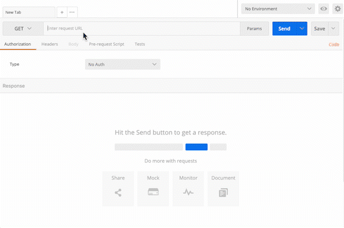

## 🚀 AWS와 nginx을 이용한 서버 배포

<br />

### 🔖 목차

- [🚀 AWS와 nginx을 이용한 서버 배포](#-aws와-nginx을-이용한-서버-배포)
  - [🔖 목차](#-목차)
    - [🌕 프로젝트 실행 및 테스트](#-프로젝트-실행-및-테스트)
    - [🧐 배포 명세](#-배포-명세)
    - [💿 기술 스택](#-기술-스택)

<br />

#### 🌕 프로젝트 실행 및 테스트

**1. 실행 방법** 💡

- local 실행시 명령어

```
git clone https://github.com/pre-onboarding-backend-E/04-DeployAPP-E
git checkout taeyoung
docker compose build
docker compose up
```

**2. API 테스트 방법** 💡

<details>

<summary style=bold>토글을 열어 확인</summary>
<div markdown="1">



</div>
</details>

- local
  - http://localhost/api/docs
- deployed server
  - http://3.39.69.233/api/hello - 배포 서버 링크

**3. Swagger 테스트 방법** 💡

<details>

<summary style=bold>토글을 열어 확인</summary>
<div markdown="1">


</div>
</details>

- local
  - http://localhost/api/docs 접속
- deployed server
  - http://3.39.69.233/api/docs 접속 - 배포 서버 링크 ( 스웨거 )

**4. TDD** 💡

- NestJS 기본 제공 jest 파일에서 리턴값만 수정

#### 🧐 배포 명세

---

```
- EC2 micro 사용
- docker-compose로 hello-service와 nginx 프록시 서버 컨테이너 설정
  - hello-service
    - 포트 : 3000
    - Nestjs
    - Nestjs-swagger
  - nginx
    - 포트 : 80
- elastic IP를 이용해 EC2 인스턴스에 관한 IP 주소를 3.39.69.233로 고정
```

#### 💿 기술 스택

---

<br>
<div align='center'> 🖥&nbsp&nbsp&nbsp사용한 기술 스택</div>
<br>
<p align="center">
📑&nbsp&nbsp&nbsp구성 언어
  </p>
<p align="center">

  </p>
 <p align="center">
🏠&nbsp&nbsp&nbsp 배포
  </p>
<p align="center">

  </p>
<p align="center">
🏖&nbsp&nbsp&nbsp 서버
  </p>
<p align="center">

&nbsp&nbsp

&nbsp&nbsp

&nbsp&nbsp

&nbsp&nbsp

</p>

---
